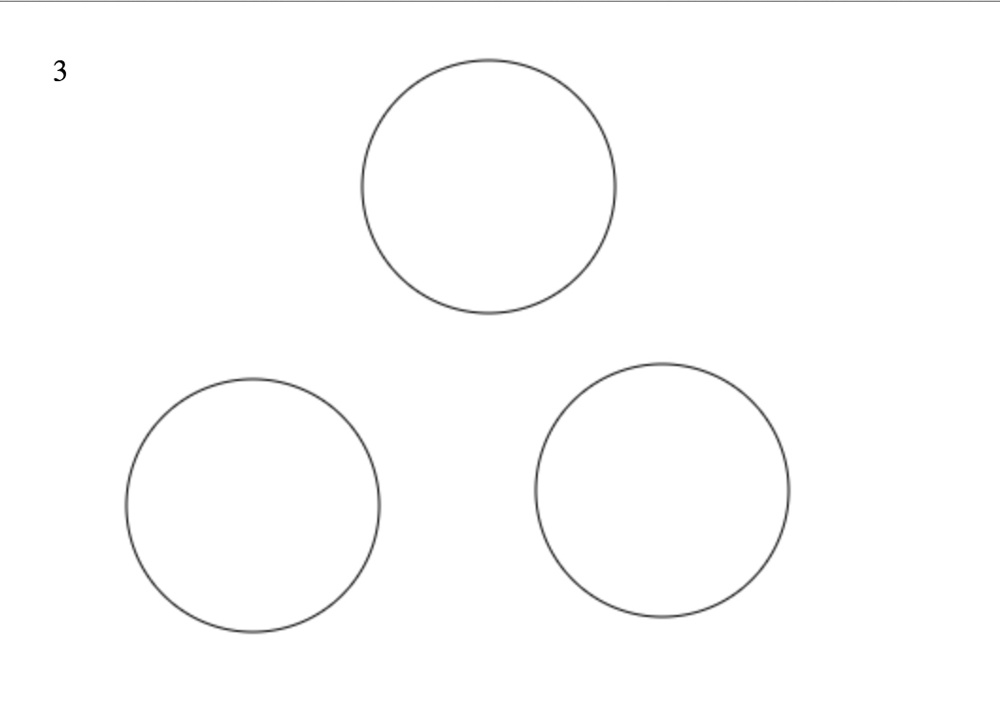
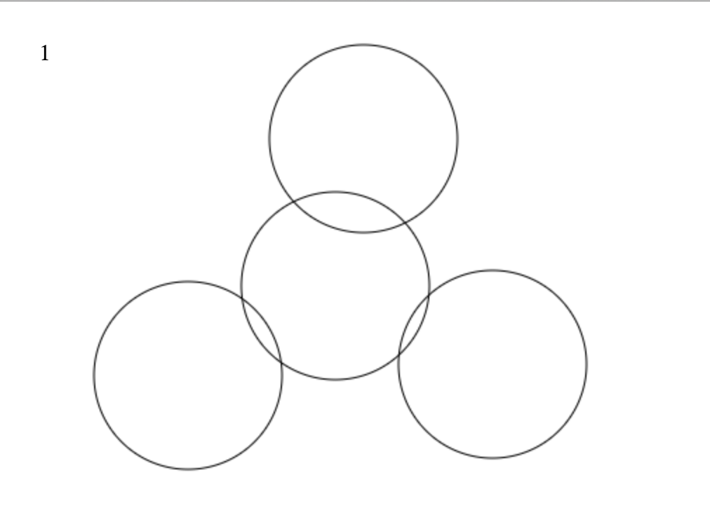

# Description

This is a simple app I've been making to try out HTML5 canvas. The user can draw
circles by clicking the mouse. There are also buttons to pan the screen left and
right.

The app is written in plain Javascript. I've decided not to use jQuery as I felt
it was a bit unnecessary since there are only a couple of events on the page which
need handling and these can be done quite easily with plain Javascript.

# Installation and Usage

From your command line, run 
```
git clone https://github.com/dbatten4/circles.git
cd circles
open index.html
```

# Testing

The app is currently untested as I've been messing about with it and trying new
things. When I have the logic completed I will rewrite the app with appropriate
testing.

# Challenges

The tricky part of this app comes in the form of an indicator on the
screen which shows the total number of compound shapes the circles make. If two
circles don't overlap, then the number of compound shapes for those two circles
is 2. If two circles do overlap, then the number of compound shapes for those
two circles is 1. For scenarios where adding a circle either doesn't affect the
number of compound shapes or increases the number of compound shapes, the logic
is relatively simple. However, for scenarios where adding a circle causes the
number the compound shapes to decrease, the logic has proven to be quite
complex. For example, consider the following scenario



Here the three circles don't overlap and so the total number of compound shapes is
3. However, adding a circle in the middle which intersects all three circles will
cause the total number of compound shapes to decrease to 1 as shown below.



The logic to handle a scenario where an added circle intersects n circles is where
the complexity lies.
